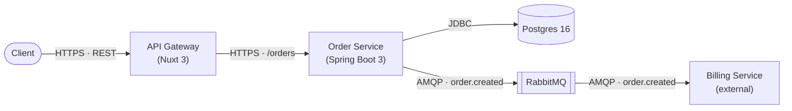

# Template: `docs_context` (CONTEXT.md)

≤150 lines (≤175 with the optional diagram) · 4 required sections + 1 optional diagram · no
class/method names — PM-readable. This is the entry-point file — its path *is* the `docs_context`
key. Its companion `system.md` lives in the same directory and is linked, not embedded.

```markdown
---
type: business-context
service: [service]
version: 1.0
updated: [today]
tags: [business, product, user-journeys]
---

# [service] — Business Context

> Business-facing. Technical/interface details: [system.md](system.md).

## Service Purpose
[2–3 lines, PM-readable]

## User Journeys
- [end-to-end flow; prefix inferred ones with `[inferred]`]

## Domain Concepts
- **[Concept]** — [one line, business language]

## Owned Capabilities
- [what this service is responsible for]

## System at a Glance
<!-- Optional. Generated only when the user opts in — see the skill's Step 3.1. -->
Nodes are components and their runtime; arrows are the transport and what crosses them.


```

**Authoring notes:**
- Derive User Journeys from endpoint groups, listener classes, and integration-test method
  names (`whenX_thenY`) — prefix anything not confirmed by an explicit spec/doc with
  `[inferred]`.
- The companion link is a relative path (`system.md`) — it resolves correctly regardless of
  where `docs_context` itself is configured, as long as both files sit in the same directory.

**System at a Glance (optional section) — authoring rules:**
- **Opt-in only.** Never generate it unprompted; the skill asks once on fresh generation and
  maintains it thereafter only if it's already there.
- **Last section in the file.** It's an orientation aid, not a contract — nothing else keys off it.
- **≤12 nodes, ≤25 lines.** Past that it stops being glanceable; cut to the flows that carry the
  service's purpose rather than shrinking the labels.
- **Component granularity, never class granularity.** `Order Service`, `Postgres`, `RabbitMQ` —
  never `OrderController`, `OrderRepository`. This file stays PM-readable; class names live in
  `system.md`'s Architecture Map.
- **The arrow labels are the point.** Each carries transport plus what crosses it —
  `HTTPS · /orders`, `AMQP · order.created`, `JDBC`, `gRPC`. Topology alone duplicates Data Flow;
  topology *with* transport is the one view neither `Data Flow` nor `Tech Stack` gives on its own.
- **Node labels carry the tech**, in parentheses on a second line: `Order Service<br/>(Spring Boot 3)`.
  Mark anything outside this repo `(external)`.
- **Every node and every label must trace to `system.md`** — nodes to an Architecture Map row,
  File Index entry, or External Dependencies system; transports and versions to Tech Stack,
  External Dependencies, or Events. Invent nothing here that isn't already recorded there; this
  is a projection of `system.md`, the same way `service-manifest.md` is.
- **On reconcile**, re-derive it from the refreshed facts rather than patching arrows by hand —
  a diagram that disagrees with `system.md` is worse than no diagram.
